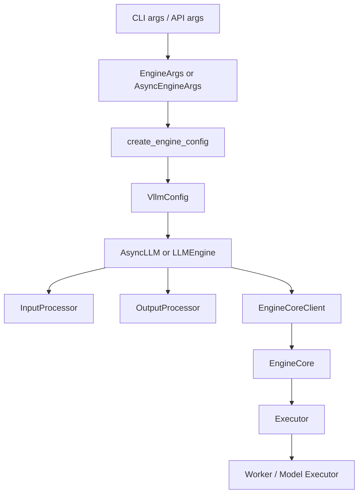

# vllm-hust 引擎执行链拆解

本文只关注一条主线：从外部请求进入 `vllm-hust` 之后，参数如何收敛、请求如何转内部对象、引擎如何把请求送入 EngineCore，再到执行器与 worker 如何接住这条链。

## 1. 先抓住 7 个控制点

如果只想用最短路径建立执行面的理解，建议先抓住这 7 个文件：

1. `vllm/entrypoints/cli/main.py`
1. `vllm/entrypoints/openai/api_server.py`
1. `vllm/engine/arg_utils.py`
1. `vllm/v1/engine/async_llm.py`
1. `vllm/v1/engine/llm_engine.py`
1. `vllm/v1/engine/core_client.py`
1. `vllm/v1/executor/`

这 7 个点分别对应：启动入口、协议入口、配置装配、异步引擎门面、同步引擎门面、EngineCore 通信接口，以及执行器选择。

## 2. 启动链不是从模型开始，而是从参数收敛开始

很多人第一次读 vLLM 类代码时，会先去看模型或者 attention kernel，但真正决定“服务怎么跑起来”的第一关键点其实是 `EngineArgs`。

`vllm/engine/arg_utils.py` 的角色可以概括成三步：

- 从 CLI/FastAPI 入口接收大量用户参数。
- 把参数拆进 `vllm/config/` 下的细粒度配置对象。
- 在 `create_engine_config()` 中统一组装成 `VllmConfig`。

这一步的重要性在于：

- 入口层不需要知道调度细节。
- 引擎层不需要直接操作原始命令行参数。
- 执行层只消费已经过约束和默认值收敛的配置对象。

## 3. 同步与异步引擎其实共享一条核心路径

当前 `vllm-hust` 里，`vllm/engine/llm_engine.py` 已经把 `LLMEngine` 直接指到 V1 实现。实际运行时可以分为两种门面：

- `vllm/v1/engine/llm_engine.py`：同步门面，偏离线调用与兼容路径。
- `vllm/v1/engine/async_llm.py`：异步门面，偏服务化和 OpenAI API 路径。

它们并不是两套完全不同的执行系统，而是两种不同的“前台接口”，后面都要落到：

- `InputProcessor`
- `OutputProcessor`
- `EngineCoreClient`
- `Executor`

这说明同步/异步差异主要发生在“怎么接请求、怎么取输出”，而不是“底层怎么算”。

## 4. `AsyncLLM` 的真实职责

`vllm/v1/engine/async_llm.py` 里的 `AsyncLLM` 是服务场景里的关键桥梁。它的职责不是直接执行模型，而是负责把几个组件绑起来：

- `renderer` 和 `io_processor`：做输入渲染与模型相关 IO 处理。
- `InputProcessor`：把 Prompt、参数、多模态输入转成 `EngineCoreRequest`。
- `OutputProcessor`：把引擎输出恢复成对 API 层有意义的输出对象。
- `EngineCoreClient.make_async_mp_client(...)`：启动并连接后台 EngineCore 进程。
- `Executor.get_class(vllm_config)`：决定真正采用哪种执行器。

所以 `AsyncLLM` 最准确的定位是：

- 它是服务入口与执行核心之间的异步编排器；
- 它知道如何开引擎、送请求、取结果、做日志与指标；
- 它并不是模型层级算子的所有者。

## 5. `LLMEngine` 的真实职责

同步路径下，`vllm/v1/engine/llm_engine.py` 中的 `LLMEngine` 扮演类似角色，只是接口形态更偏同步。它仍然会组织：

- `InputProcessor`
- `OutputProcessor`
- `EngineCoreClient.make_client(...)`
- `Executor.get_class(vllm_config)`

这意味着一个很实用的判断：

- 如果问题发生在“请求怎么被整理、怎么被分发、为什么输出格式不对”，先看 `LLMEngine` / `AsyncLLM`。
- 如果问题发生在“底层为何卡住、worker 为什么异常、模型为何没执行”，继续往下看 EngineCore 和 Executor。

## 6. EngineCoreClient 是执行链真正的分界线

`vllm/v1/engine/core_client.py` 是整个执行架构中的关键边界层。

它通过 `make_client()` / `make_async_mp_client()` 把调用侧与执行核心解耦成几种模式：

- 进程内执行
- 多进程同步执行
- 多进程异步执行
- 数据并行场景下的多引擎客户端

这层的架构价值非常高：

- 上层无需关心 EngineCore 究竟在本进程还是子进程。
- 不同运行模式共享统一的请求/输出接口。
- 后续扩展 DP 外部负载均衡、异步 RPC 等能力时，不需要回写 API 层。

## 7. Executor 决定“用什么方式驱动 worker”

`vllm/v1/executor/__init__.py` 当前暴露的公开入口非常薄，但实际意义很大：`Executor.get_class(vllm_config)` 决定具体执行器实现。

这说明执行链又被切开了一层：

- EngineCore 负责调度与编排。
- Executor 负责把这些调度命令落实到 worker / 进程 / 通信模型上。

对模块化设计来说，这样的分层是合理的，因为：

- 调度策略不等于进程组织方式。
- 数据并行、单进程、多进程等实现差异应当留在 executor 层。

## 8. 引擎执行链可以简化成这张图

这张图想表达的重点是：

- 参数收敛先于引擎实例化。
- 引擎门面先于 EngineCore。
- EngineCore 先于 worker 执行。

如果把这些顺序搞反，就很容易把问题定位错层。

## 9. OpenAI 服务路径为什么优先走 `AsyncLLM`

`vllm/entrypoints/openai/api_server.py` 中的 `build_async_engine_client_from_engine_args()` 很清楚地说明：OpenAI 服务路径会：

- 用 `AsyncEngineArgs.from_cli_args(args)` 获取异步配置；
- 调 `create_engine_config()` 生成 `VllmConfig`；
- 通过 `AsyncLLM.from_vllm_config(...)` 创建引擎门面。

这样做的原因很直接：

- 服务化需要异步处理请求和流式输出。
- 服务化需要后台引擎进程与 API 进程解耦。
- 服务化需要更稳定的 metrics、logging 和 client lifecycle 管理。

## 10. 什么时候应该读 `InputProcessor`

如果你看到的问题是：

- prompt 渲染后不符合预期
- 多模态输入没有变成正确的内部结构
- sampling params / pooling params 没有按预期进入引擎

那下一站应该是 `vllm/v1/engine/input_processor.py`，而不是直接跳到模型或 kernel。

因为从执行链的职责划分看，输入层的错误大多发生在“请求进入 EngineCore 之前”。

## 11. 什么时候应该读 `OutputProcessor`

如果你看到的问题是：

- 流式输出分段不对
- usage / metrics 字段缺失
- 输出对象和协议层预期不一致

那下一站通常是 `vllm/v1/engine/output_processor.py`。

这层不是协议实现本身，但它决定了引擎结果如何恢复为上层可消费的结构。

## 12. 开发时的实用排查顺序

### 场景 A：服务起不来

先看：

- `entrypoints/cli/*`
- `entrypoints/openai/api_server.py`
- `engine/arg_utils.py`

### 场景 B：请求进入后没有输出

先看：

- `v1/engine/async_llm.py`
- `v1/engine/core_client.py`
- `v1/engine/core.py`

### 场景 C：输出结构不对

先看：

- `entrypoints/openai/*/serving.py`
- `v1/engine/output_processor.py`

### 场景 D：模型真正执行异常

先看：

- `v1/executor/*`
- `model_executor/*`

## 13. 一句话总结

`vllm-hust` 的引擎执行链并不是“一层直接调用下一层”的朴素结构，而是：

- 用 `EngineArgs` 做配置收敛；
- 用 `AsyncLLM` / `LLMEngine` 做前台编排；
- 用 `EngineCoreClient` 切开调用层与执行层；
- 用 `Executor` 把调度命令真正落实到 worker 与模型执行体系。

这套分层既解释了为什么它适合高并发 serving，也解释了为什么 fork 可以在尽量不动共享热路径的情况下继续扩展。