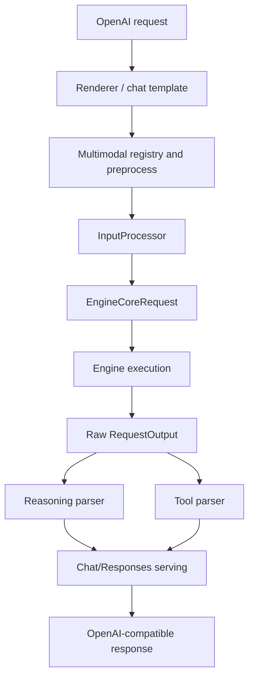

# vllm-hust 多模态与 AGI4S 能力链拆解

如果只把 `vllm-hust` 看成“文本生成引擎”，会直接读错仓库重点。当前代码结构已经表明，它在多模态、reasoning、tool calling、rendering 和结构化输出上，已经形成了独立的横切能力层。

这篇文档只讲这条能力链。

## 1. 先抓住 5 个目录

1. `vllm/multimodal`
1. `vllm/reasoning`
1. `vllm/tool_parsers`
1. `vllm/renderers`
1. `vllm/entrypoints/openai/`

如果想进一步看请求如何进入这些模块，再回到：

1. `vllm/v1/engine/input_processor.py`
1. `vllm/v1/engine/output_processor.py`

## 2. 多模态不是附属功能，而是独立 subsystem

`vllm/multimodal/__init__.py` 公开了 `MultiModalRegistry` 和全局 `MULTIMODAL_REGISTRY`。这说明多模态支持不是 scattered utility，而是有正式注册中心的。

这层大致负责：

- 多模态输入结构定义
- 输入解析
- 媒体处理
- cache / hash / encoder budget
- 进入模型执行前的统一分发

它的架构意义在于：

- 模型执行层不需要自己解析所有图像/视频/音频原始输入。
- 外部请求层也不需要知道不同模型的多模态细节。

这是一种典型的“输入适配逻辑从模型中剥离”的模块化做法。

## 3. reasoning parser 是“输出解释层”，不是采样层

`vllm/reasoning/__init__.py` 中注册了大量 lazy reasoning parser，例如：

- `deepseek_r1`
- `deepseek_v3`
- `ernie45`
- `hunyuan_a13b`
- `kimi_k2`
- `minimax_m2`
- `qwen3`
- `step3` / `step3p5`

这些 parser 的意义不是参与 token 生成，而是负责：

- 如何从模型输出中识别 reasoning 片段
- 如何保留或裁剪思考内容
- 如何把模型特有的 reasoning 格式还原成上层 API 可消费的结构

这说明 `vllm-hust` 已经把“推理模型输出兼容性”独立成一层，而不是把规则塞进 chat serving 主逻辑。

## 4. tool parser 是 agent 场景的另一条独立输出链

`vllm/tool_parsers/__init__.py` 注册的 lazy parser 同样很密集，覆盖：

- `deepseek_v3*`
- `ernie45`
- `glm45` / `glm47`
- `hunyuan_a13b`
- `qwen3_coder` / `qwen3_xml`
- `step3` / `step3p5`
- `minimax*`
- `kimi_k2`

这层负责的是：

- 不同模型的 tool calling 输出协议差异
- 如何把文本增量解析成结构化 tool call
- 自动工具选择与 parser 行为的兼容

换句话说，tool parser 是 vLLM 进入 agent serving 场景的关键桥梁之一。

## 5. OpenAI 服务层如何接这些横切能力

`vllm/entrypoints/openai/chat_completion/serving.py` 很能说明这条能力链的接法。

`OpenAIServingChat` 在初始化时会：

- 通过 `ParserManager.get_reasoning_parser(...)` 装配 reasoning parser
- 通过 `ParserManager.get_tool_parser(...)` 装配 tool parser
- 根据模型配置、chat template、sampling 配置决定输出行为

这说明 API 服务层本身并不实现 reasoning 和 tool parsing 的细节，它只是：

- 按请求与模型配置选择对应 parser
- 在流式或非流式返回中使用 parser 的结果

这种分层很重要，因为它保证了：

- 新模型的 reasoning / tool 行为可以通过新增 parser 扩展；
- 不必把每个模型的解析逻辑写进统一 chat serving 文件。

## 6. renderers 是输入侧的另一条隐藏主线

虽然这次没有逐文件展开 `vllm/renderers`，但从 `AsyncLLM`、`LLMEngine` 和 `OpenAIServing` 的依赖关系可以看出，renderer 在整个 AGI4S 能力链中承担了重要角色：

- chat template 渲染
- tokenizer 侧输入组织
- 面向不同请求形态的统一 prompt 构造

因此，输入侧可以概括为：

- renderer 负责把外部协议输入整理成模型能理解的 prompt 形态；
- multimodal 层负责把多模态内容变成模型执行需要的数据结构；
- input processor 再把它们组装成 EngineCoreRequest。

## 7. 输出侧能力链可以简化成这张图

这个图要强调的是：

- 多模态更多发生在输入侧；
- reasoning 与 tool calling 更多发生在输出解释侧；
- 两者都不是模型执行主循环本身。

## 8. 为什么这条链和 AGI4S 强相关

AGI4S 场景通常不是单一文本补全，而是组合能力场景：

- 多模态输入
- reasoning 输出
- tool use
- structured output
- 流式交互

从当前仓库结构看，`vllm-hust` 已经把这些能力当成一等公民对待，而不是零散补丁：

- 多模态有 registry 和独立子目录
- reasoning 有统一 parser manager
- tool calling 有统一 parser manager
- OpenAI 服务层直接消费这些能力

这说明仓库的目标不是“跑模型就行”，而是“把复杂模型能力变成稳定服务接口”。

## 9. 开发时如何选切入点

### 9.1 多模态输入错了

先看：

- `vllm/multimodal/*`
- `vllm/renderers/*`
- `vllm/v1/engine/input_processor.py`

### 9.2 reasoning 输出不对

先看：

- `vllm/reasoning/*`
- `entrypoints/openai/chat_completion/serving.py`

### 9.3 tool calling 行为不对

先看：

- `vllm/tool_parsers/*`
- `entrypoints/openai/chat_completion/serving.py`
- `entrypoints/openai/responses/*`

### 9.4 chat template 行为不对

先看：

- `vllm/renderers/*`
- `vllm/entrypoints/chat_utils.py`

## 10. 一句话总结

`vllm-hust` 的多模态与 AGI4S 能力并不是“附着在推理引擎上的一些小功能”，而是一条清晰的横切能力链：

- 输入侧有 renderer 和 multimodal registry；
- 输出侧有 reasoning parser 和 tool parser；
- API 层负责装配和暴露，而不承载所有模型差异。

这也是它能持续扩展国内新模型和复杂服务场景的关键基础。