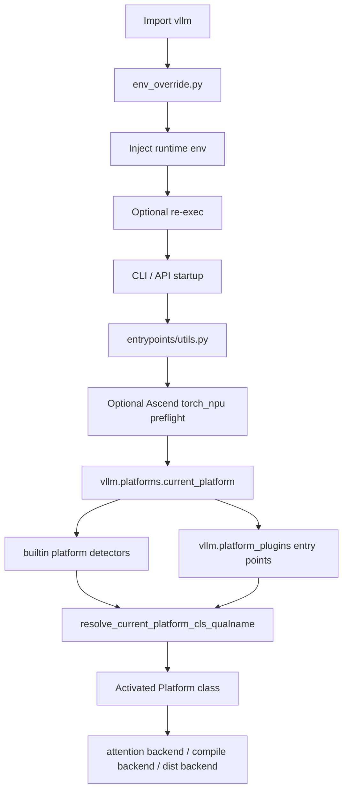

# vllm-hust 平台插件链拆解

`vllm-hust` 在硬件适配上的最大特点，不是“直接把国产硬件逻辑写进核心引擎”，而是把平台识别、插件注入、运行时护栏和外部工具协作拆成了一条相对清晰的链。

这条链决定了 fork 是否还能持续与 upstream 合并。

## 1. 先看 4 个关键锚点

1. `vllm/platforms/interface.py`
1. `vllm/platforms/__init__.py`
1. `vllm/plugins/__init__.py`
1. `vllm/env_override.py`

如果是 Ascend 启动体验，还要额外看：

1. `vllm/entrypoints/utils.py`
1. `README.md` 中与 `vllm-ascend-hust`、`ascend-runtime-manager` 相关的说明

## 2. 平台抽象先于平台实现

`vllm/platforms/interface.py` 里定义的 `Platform` 抽象，不是为了“列举支持哪些硬件”，而是为了统一这些差异点：

- device type / dispatch key
- ray 设备键
- compile backend
- distributed backend
- 支持的 dtype
- 平台相关 kernel 导入
- attention backend 选择

这意味着：

- 平台差异的合法落点应当是 `Platform` 能力差异；
- 而不是在模型实现、OpenAI 服务层或引擎主循环里四处写硬件 if/else。

## 3. 当前平台由“内建探测 + 外部插件”共同决定

`vllm/platforms/__init__.py` 的逻辑大致是：

- 先定义内建平台探测器：`cuda`、`rocm`、`xpu`、`cpu`、`tpu`
- 再通过 `load_plugins_by_group("vllm.platform_plugins")` 发现外部插件
- 最终只允许一个平台插件激活

这一点对 fork 很关键，因为它明确规定了平台接入方式：

- 主干仓库负责平台抽象和选择框架；
- 外部硬件仓库负责真正的平台实现；
- 平台是被“发现并激活”的，而不是“被主仓库硬编码写死”的。

## 4. 插件系统不是附属功能，而是 merge-safe 扩展的核心

`vllm/plugins/__init__.py` 支持至少四类插件组：

- `vllm.general_plugins`
- `vllm.io_processor_plugins`
- `vllm.platform_plugins`
- `vllm.stat_logger_plugins`

从 fork 维护角度看，这有两个直接收益：

- 硬件平台扩展不用侵入 `vllm/v1` 主执行链。
- 非平台扩展，例如 IO 处理器和统计日志器，也可以用同样的模式外挂。

这意味着 `vllm-hust` 在设计上并没有选择“在 fork 里复制一套平台系统”，而是尽量沿用了 upstream 的扩展机制。

## 5. `env_override.py` 处理的是“能不能启动”，不是“怎么算”

`vllm/env_override.py` 的定位很容易被误解。它并不负责平台实现，而是负责在 import `torch` 之前尽量补好运行时环境。

对 `vllm-hust` 来说，这个文件最关键的 fork 增强有两类：

- CUDA 兼容库路径注入
- Ascend 运行时路径自动注入与必要时 re-exec

Ascend 自动注入部分会做几件事：

- 探测 `ASCEND_HOME_PATH`
- 最小化补齐 `LD_LIBRARY_PATH`、`PATH`
- 设置 `ASCEND_TOOLKIT_HOME`、`ASCEND_OPP_PATH`
- 在需要时重新执行当前 Python 进程，确保 loader-sensitive 环境变量在进程启动期生效

这条链的价值在于：

- 它把“运行时环境拼装”前移到了 import 阶段；
- 避免用户每次都手工 source 一堆脚本；
- 同时又保持平台实现本身仍在插件或外部仓库里。

## 6. CLI 预检是平台链上的第二道护栏

`vllm/entrypoints/utils.py` 里还有一层与 Ascend 强相关的保护：

- 在 `serve` / `launch` 命令下，若检测到 Ascend 运行时迹象，就先执行 `torch_npu` 预检。

其本质是：

- 用一个最小 PyTorch NPU 张量分配动作验证运行时；
- 如果失败，在引擎启动前就直接报错；
- 把“底层 runtime 不可用”和“vLLM 逻辑异常”尽量分离开。

这一步虽然不属于平台选择本身，但它和 `env_override.py` 一起构成了很完整的国产硬件启动护栏。

## 7. 为什么 Ascend 支持更适合留在外部仓库

从 `vllm-hust` 当前结构可以看出，Ascend 相关逻辑更合理的分布是：

- 主仓库保留平台抽象、插件入口、启动预检和最小环境修复。
- `vllm-ascend-hust` 提供真正的平台插件实现。
- `ascend-runtime-manager` 负责运行时修复和环境治理。

这是一种比“把所有国产硬件逻辑都塞回 `vllm-hust`”更健康的结构，因为：

- 核心 serving runtime 仍能跟着 upstream 演进。
- 平台实现和系统环境治理可以分别独立演进。
- 风险边界更清晰，回归测试更可控。

## 8. 平台插件链可以画成这张图

这张图的核心含义是：

- 运行时环境修复和平台激活是两件事；
- 平台激活又独立于具体模型执行；
- 这样才能把 fork 的平台差异压在可维护的边界内。

## 9. 实际开发时的判断准则

### 9.1 该改 `platforms/` 的情况

- 新硬件平台需要新的能力抽象
- 现有平台能力判定错误
- attention / compile / distributed backend 选择逻辑确实属于平台能力差异

### 9.2 不该改 `platforms/` 的情况

- 某个协议层字段不对
- 某个模型 chat template 不对
- 某个工具调用解析错了

这些问题大多不属于平台层。

### 9.3 该改 `env_override.py` 的情况

- import 前必须设置的 loader-sensitive 环境变量缺失
- 单工具链下的常见运行时路径补齐失败

### 9.4 不该改 `env_override.py` 的情况

- 平台插件本身的算子逻辑
- 模型执行的设备内核选择
- 服务层协议问题

## 10. 一句话总结

`vllm-hust` 的平台链本质上是一条“平台抽象 + 插件发现 + 启动护栏 + 外部运行时治理”的组合链，而不是“把特定硬件逻辑直接焊死在核心引擎里”。

这正是它还能维持 upstream mergeability 的关键原因之一。