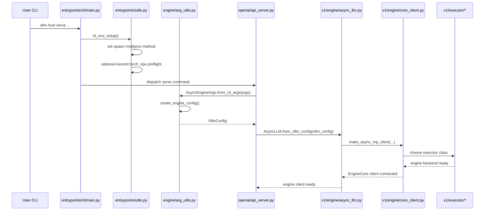
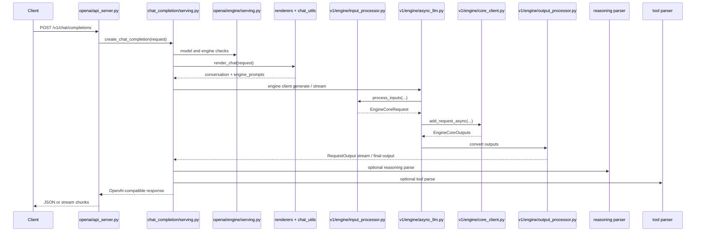
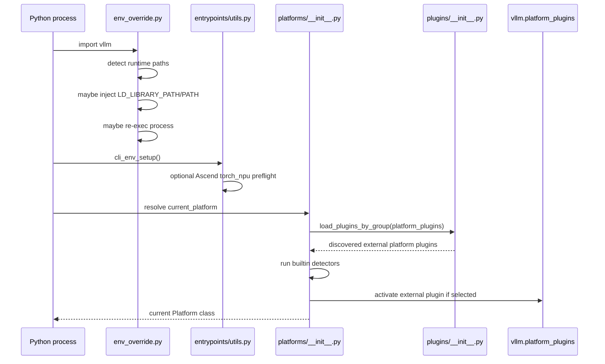
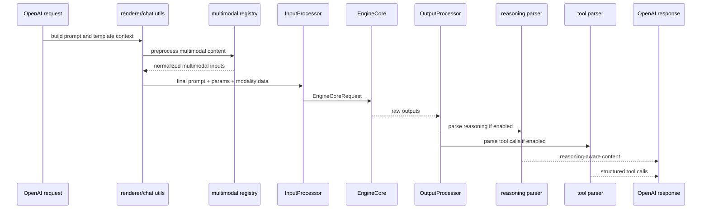

# vllm-hust 源码调用流程图

本文只做一件事：把前面总览和专题拆解里反复提到的关键路径，压缩成几张可用于代码导航和排障的调用流程图。

## 1. CLI `serve` 启动到引擎就绪

这张图关注的是启动期，而不是单请求执行期。

这条链说明三个很重要的事实：

- 启动时的关键不是模型层，而是 `cli_env_setup()` 和 `create_engine_config()`。
- OpenAI 服务启动本质上是创建 `AsyncLLM` 并绑定 EngineCore 客户端。
- Executor 的选择发生在引擎创建过程中，而不是请求到来之后。

## 2. OpenAI Chat 请求调用链

这张图关注的是单次 Chat Completion 请求从 API 到引擎，再回到响应的主线。

最容易读错的一点是：

- chat serving 不直接执行模型；
- 它负责渲染请求、选择 reasoning/tool parser、消费引擎输出并还原协议。

## 3. 平台激活与 Ascend 护栏流程

这张图关注的是平台路径，而不是请求路径。

这张图强调两件事：

- 运行时环境补齐与平台选择不是同一件事；
- Ascend 相关 fork 增强更多在“启动护栏”和“插件接入”，而不是共享执行链本体。

## 4. 多模态与 AGI4S 能力调用链

这张图把多模态、reasoning 和 tool calling 放到同一张图里，看它们分别介入哪一段。

它说明：

- 多模态主要介入输入侧。
- reasoning 和 tool calling 主要介入输出解释侧。
- OpenAI 响应层只是把这些模块的结果重新打包给客户端。

## 5. 用流程图排障时怎么选图

### 服务启动失败

先看“CLI `serve` 启动到引擎就绪”。

### 请求到了但没生成

先看“OpenAI Chat 请求调用链”。

### Ascend 环境反复出问题

先看“平台激活与 Ascend 护栏流程”。

### 多模态、reasoning、tool use 行为不对

先看“多模态与 AGI4S 能力调用链”。

## 6. 一句话总结

这些图想传达的不是“调用很多”，而是“每类问题其实都能被定位到少数几个清晰边界”：

- 启动护栏边界
- 配置收敛边界
- 引擎编排边界
- 平台插件边界
- 多模态与 AGI4S 横切能力边界

只要沿这些边界读代码，`vllm-hust` 的复杂度会下降很多。