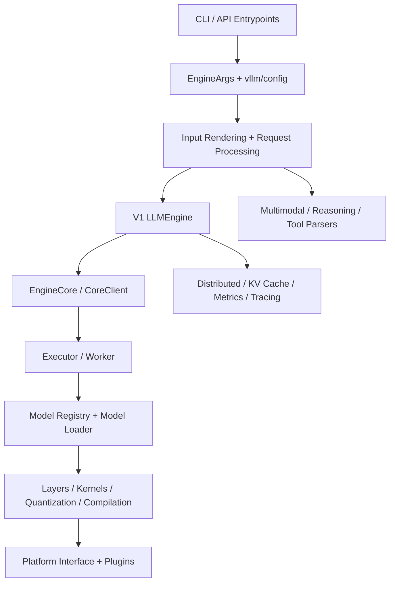

# vllm-hust 源码模块化解构

本文的目标不是逐文件罗列 `vllm-hust`，而是给出一套可以直接指导开发和排障的“模块化心智模型”。

对当前仓库更准确的理解是：

- 它在打包层面叫 `vllm-hust`，但 Python 命名空间仍然是 `vllm`。
- 它仍然以 upstream vLLM 的主干架构为骨架。
- 与国产硬件和 AGI4S 场景相关的增强，优先通过插件、平台探测、启动预检、运行时修复工具和模型/解析器扩展来落地，而不是粗暴地改写共享热路径。

这意味着分析 `vllm-hust` 时，最重要的不是“哪里改过”，而是“它把哪些问题留在主干架构里解决，哪些问题放到 fork 外围或插件层解决”。

## 1. 总体分层

从运行时视角看，`vllm-hust` 可以被拆成 8 层：

1. 接口与入口层：CLI、OpenAI 兼容服务、离线推理入口。
1. 参数与配置装配层：把命令行、环境变量、模型参数收敛成统一 `VllmConfig`。
1. 请求编排层：负责把外部请求转成内部请求对象，并维护流式输出生命周期。
1. 引擎核心层：调度、批处理、并行状态、EngineCore 通信。
1. 模型执行层：模型注册、权重加载、runner、worker、层级算子。
1. 平台与插件层：平台探测、硬件插件、设备能力与后端选择。
1. 横切能力层：多模态、reasoning、tool calling、rendering、tokenizer。
1. 性能基础设施层：编译、量化、KV cache、distributed、profiling、tracing。

可以把它们近似看成下面这条控制链：

## 2. 顶层目录应该怎么读

如果把 `vllm-hust/vllm` 当成主体代码区，最值得优先建立坐标感的目录如下：

| 目录 | 作用 | 读法建议 |
| --- | --- | --- |
| `vllm/entrypoints` | 所有外部入口 | 先看它，理解请求从哪进来 |
| `vllm/engine` | 对外引擎门面 | 重点看 `arg_utils.py` 和 `llm_engine.py` |
| `vllm/v1` | 当前主执行引擎 | 真正的调度与执行控制中心 |
| `vllm/model_executor` | 模型执行体系 | 权重加载、模型注册、层与算子都在这里 |
| `vllm/platforms` | 平台抽象 | 决定当前硬件后端如何被激活 |
| `vllm/plugins` | 插件机制 | fork 的“低侵入扩展”关键入口 |
| `vllm/config` | 配置 schema | 把大量参数拆成可组合对象 |
| `vllm/multimodal` | 多模态数据处理 | 图像、音频、视频等输入进入执行图前的桥梁 |
| `vllm/reasoning` | reasoning 输出解析 | 面向带思维链/思考标记模型的后处理 |
| `vllm/tool_parsers` | 工具调用解析 | 不同模型的 function/tool calling 适配层 |
| `vllm/compilation` | 编译与图优化 | 静态图、piecewise backend、codegen |
| `vllm/distributed` | 分布式执行 | TP/DP/PP/EP 以及相关通信工具 |

一个实用结论是：`vllm-hust` 并不是一个“只有推理内核”的仓库，而是一个把接口、协议、渲染、调度、执行、平台、模型、工具调用和多模态都串起来的完整 serving runtime。

## 3. 入口层：外部请求从哪里进入系统

最关键的入口文件有三类：

- `vllm/entrypoints/cli/main.py`
- `vllm/entrypoints/openai/`
- `vllm/entrypoints/llm.py`

### 3.1 CLI 是一个命令分发器，而不是业务中心

`vllm/entrypoints/cli/main.py` 的工作很克制：

- 懒加载子命令模块，避免过早 import 触发后端初始化。
- 调用 `cli_env_setup()` 做进程级环境准备。
- 根据子命令把执行权交给 `serve`、`launch`、`bench`、`collect_env` 等模块。

这里的重点不在“命令多”，而在于它把启动时序控制得很严。对于硬件相关问题，这个时序尤其重要，因为很多失败发生在“真正启动引擎之前”。

### 3.2 `cli_env_setup()` 是 fork 差异的重要挂点

`vllm/entrypoints/utils.py` 里有两个关键动作：

- 默认把 `VLLM_WORKER_MULTIPROC_METHOD` 设为 `spawn`。
- 在 `serve` / `launch` 等命令下，按条件执行 Ascend `torch_npu` 预检。

这说明 `vllm-hust` 在 CLI 阶段就主动区分“框架问题”和“底层运行时问题”：

- 如果 `torch_npu` 连最小的 `torch.zeros(..., device='npu:0')` 都过不了，直接在引擎启动前失败。
- 这样能避免用户把 CANN、驱动、OPP、`torch_npu` 安装问题误判成 vLLM 逻辑错误。

从架构角度看，这属于“启动护栏”，不是“执行内核”。它把 fork 对国产硬件的体验增强放在外围，而不是把故障处理塞进主执行路径。

### 3.3 OpenAI 服务层负责协议适配，而不是模型执行

OpenAI 兼容服务相关逻辑位于 `vllm/entrypoints/openai/`。这一层主要负责：

- HTTP/FastAPI 路由与请求对象定义。
- Chat/Responses/Completions 等 API 协议适配。
- 流式返回、取消、异常包装和服务端负载感知。

这一层的设计原则很明确：它不直接做推理，而是把外部协议翻译成引擎可以消费的内部请求对象，再把内部输出还原成协议响应。

## 4. 参数与配置层：为什么 `arg_utils.py` 是整个系统的中轴

`vllm/engine/arg_utils.py` 是这套架构里最容易被低估的文件。

它承担了三件事：

1. 把 CLI 参数映射成结构化配置。
1. 把 `vllm/config/*` 下拆散的配置对象重新组装成一个 `VllmConfig`。
1. 在启动前完成大量约束检查和默认值收敛。

`vllm/config/` 目录本身就是一次很明显的模块化拆分：

- `model.py` 负责模型与 tokenizer 相关参数。
- `cache.py` 负责 KV cache、prefix cache、Mamba cache 等。
- `parallel.py` 负责 TP、DP、EP、通信后端等。
- `multimodal.py` 负责多模态预算与传输方式。
- `reasoning.py`、`structured_outputs.py` 负责高级能力开关。
- `compilation.py` 负责图编译、piecewise backend、cudagraph 等。

这层的价值在于，它把一个看似“巨大的启动参数平面”压缩成了若干彼此职责清晰的 schema。后续引擎、worker、后端、解析器基本都围绕这些配置对象工作。

## 5. 引擎层：当前分支本质上已经是 V1 引擎为主

一个非常关键的事实是：`vllm/engine/llm_engine.py` 当前只是一个别名转发：

- 它把 `LLMEngine` 直接指向 `vllm.v1.engine.llm_engine.LLMEngine`。

这意味着：

- 如果你想理解当前 `vllm-hust` 的真实执行流程，不应该停留在旧 `engine/` 目录的表层。
- 真正的调度、请求转换、输出处理和 core 通信逻辑，已经主要落在 `vllm/v1/` 下。

### 5.1 V1 `LLMEngine` 是一个编排器，不是算子执行器

`vllm/v1/engine/llm_engine.py` 中的 `LLMEngine` 主要负责连接这些对象：

- `InputProcessor`：把 prompt / multimodal 输入 / sampling params 转成 `EngineCoreRequest`。
- `OutputProcessor`：把 `EngineCoreOutputs` 还原成用户可见的 `RequestOutput`。
- `EngineCoreClient`：与真正的 engine core 通信。
- `renderer` 和 `io_processor`：处理输入渲染与 IO 预处理。

因此，这一层更像“请求编排总线”：

- 它知道如何接外部请求。
- 它知道如何管理请求生命周期。
- 但它并不直接决定某个算子怎么跑、某个 kernel 怎么选、某个模型层怎么执行。

### 5.2 真正的执行核心继续往下在 `vllm/v1/engine/core.py`

`vllm/v1/engine/` 目录继续向下拆成：

- `core.py`：EngineCore 本体。
- `core_client.py`：同步/异步/多进程 client。
- `input_processor.py` / `output_processor.py`：输入输出边界层。
- `parallel_sampling.py`、`structured_output/`、`spec_decode/`：高级采样与输出能力。

对开发者来说，理解 `LLMEngine` 的最佳方式是：

- 它是 runtime orchestration；
- 真正的数据通路与执行节拍，由更底层的 EngineCore、Executor、Worker 和 Model Executor 共同完成。

## 6. 模型执行层：`model_executor` 才是“推理发生的地方”

`vllm/model_executor` 是源码中最重、也最值得按子模块拆开的部分。

### 6.1 `models/registry.py` 是模型体系的总入口

`vllm/model_executor/models/registry.py` 定义了非常大的模型架构映射表。它至少说明了三件事：

- `vllm-hust` 通过 registry 统一管理不同模型家族的落地实现。
- 国内模型和推理模型的覆盖面相当高，比如 `Ernie4_5*`、`BailingMoe*`、`HunYuan*`、`Pangu*`、`Qwen3*`、`MiniMax*` 等。
- 模型接入优先走“注册 + 映射 + 兼容接口”，而不是到处写条件分支。

这套 registry 设计的直接收益是：

- 模型扩展成本更低。
- 上层引擎不需要理解每个模型的内部差异。
- fork 可以在不破坏全局架构的前提下增加国产模型支持。

### 6.2 `model_loader/` 管的是“权重怎么进来”

这部分不决定服务协议，也不决定调度，而是负责：

- 权重文件的加载格式。
- 分片与量化权重的读取方式。
- 与模型结构对齐的初始化流程。

如果遇到“模型能识别但起不来”的问题，第一优先排查点通常不是 API 层，而是这里与 `models/` 的配合。

### 6.3 `layers/` 和 `kernels/` 管的是“单层怎么跑”

这部分是性能最敏感的区域之一，核心关注点包括：

- attention 后端
- fused MoE
- rotary embedding
- quantization
- 自定义 kernel

它们是高性能 serving 的关键，但从架构上属于“可被引擎调用的执行组件”，而不是系统的控制中枢。

### 6.4 `offloader/` 和参数对象决定大模型的可承载性

这部分主要服务于显存/内存约束下的运行时策略。它和 KV cache、prefetch/offload、device allocator 一起决定模型能否在目标硬件上稳定跑起来。

## 7. 平台与插件层：这是 vllm-hust 保持可维护性的关键

如果说 `model_executor` 解决的是“算什么”，那 `platforms` + `plugins` 解决的是“在哪儿算、怎么挂到系统里”。

### 7.1 `vllm/platforms/interface.py` 定义统一平台抽象

`Platform` 抽象统一了这些内容：

- 设备类型与平台枚举。
- 支持 dtype。
- attention backend 选择能力。
- compile backend、distributed backend 等平台差异。
- 平台相关 kernel 导入。

这意味着硬件差异的正确落点应当是“平台能力差异”，而不是在任意模型或任意入口代码里散落硬编码。

### 7.2 `vllm/platforms/__init__.py` 用“探测 + 插件”决定当前平台

当前平台选择逻辑由两类来源组成：

- 内建平台：`cuda`、`rocm`、`xpu`、`cpu`、`tpu`
- 外部平台插件：通过 `vllm.platform_plugins` entry point 注入

这恰好解释了为什么 `vllm-hust` 可以把 Ascend 支持尽量留在外部插件仓库里：

- 主仓库只需要提供平台抽象和插件发现机制。
- 具体平台实现可以来自 `vllm-ascend-hust`。
- 这样比在主仓库里深埋一堆 Ascend 分支更容易与 upstream 保持同步。

### 7.3 `vllm/plugins/__init__.py` 是 fork 扩展的低侵入支点

这个模块支持多个插件组：

- `vllm.general_plugins`
- `vllm.io_processor_plugins`
- `vllm.platform_plugins`
- `vllm.stat_logger_plugins`

从模块化设计角度，这是一种非常关键的“扩展口前置”策略：

- 先给扩展预留合法入口；
- 再让 fork 的差异尽量通过插件挂接，而不是修改主干中枢。

## 8. fork 特有外围层：为什么 `env_override.py` 很重要

`vllm/env_override.py` 很能体现 `vllm-hust` 的工程取舍。

它做了两件与 fork 体验强相关的事：

1. 在 import `torch` 之前尝试设置 CUDA 兼容库路径。
1. 在 import `torch` 之前尝试自动补齐 Ascend 运行时路径。

Ascend 这部分尤其关键：

- 自动探测 `ASCEND_HOME_PATH`
- 最小化补齐 `LD_LIBRARY_PATH`、`PATH`
- 在必要时对解释器做一次 re-exec，确保动态链接器在正确环境中启动

这一层不负责推理算法，但它决定了“用户能不能先把服务拉起来”。

对 `vllm-hust` 而言，这其实是 fork 很有价值的一层：

- 主干 execution path 继续保持相对通用；
- 国产硬件环境修复放在 import/bootstrap 层完成。

## 9. 横切子系统：多模态、reasoning、tool calling

`vllm-hust` 不能只按“文本生成引擎”理解，因为仓库里已经把多模态与复杂 agent 场景做成了正式子系统。

### 9.1 多模态：`vllm/multimodal`

这个目录负责把图像、视频、音频等输入转成模型执行前需要的结构。其核心特征是：

- 通过 `MultiModalRegistry` 统一分发。
- 有独立的输入、解析、缓存、预算与 media 处理逻辑。
- 它是模型执行层和外部多模态输入之间的桥梁。

这说明多模态不是零散支持，而是以独立 subsystem 形式存在。

### 9.2 reasoning：`vllm/reasoning`

这一层负责的是“模型输出后如何解释 reasoning 内容”，不是普通采样本身。

当前注册器里能看到较强的 reasoning 模型密度，例如：

- `deepseek_r1`
- `deepseek_v3`
- `ernie45`
- `hunyuan_a13b`
- `kimi_k2`
- `minimax_m2`
- `qwen3`
- `step3` / `step3p5`

这类设计尤其适合 AGI4S 与复杂推理服务，因为它把“输出解析差异”从通用生成逻辑里拆了出来。

### 9.3 tool calling：`vllm/tool_parsers`

这里与 reasoning 很像，但关注点不同：

- reasoning 关心“思考内容怎么还原”
- tool parser 关心“模型的工具调用输出怎么解析成结构化动作”

从目录内容看，`vllm-hust` 对国产与新一代模型的工具调用适配覆盖较密集，例如：

- `ernie45`
- `hunyuan_a13b`
- `qwen3_coder`
- `deepseek_v3*`
- `step3*`
- `minimax*`

这说明该仓库的目标场景已经超出基础文本补全，明显面向 agent、structured output 和 tool-use 服务。

## 10. 性能基础设施层：不是单点优化，而是体系化支撑

### 10.1 `vllm/compilation`

这个目录负责图编译相关能力，包括：

- backend 选择
- codegen
- caching
- piecewise backend
- pass manager

它的架构意义在于：把“是否编译、怎么编译、编译后如何缓存”从模型逻辑里抽离出来，做成独立基础设施。

### 10.2 量化、融合与内核优化

真正的性能路径通常会同时涉及：

- `vllm/model_executor/layers/quantization`
- `vllm/model_executor/layers/fused_moe`
- `vllm/model_executor/layers/attention`
- `vllm/kernels`

这几块并不是孤立的：

- 量化决定权重表达与 kernel 兼容性。
- fused MoE 和 attention 决定高负载推理性能。
- 编译层决定这些组件如何被图捕获和重复利用。

### 10.3 `distributed/`、`device_allocator/`、`tracing/`、`profiler/`

这几个目录共同构成了生产级 serving 的运行底座：

- `distributed/` 负责多卡与通信协作。
- `device_allocator/` 负责设备内存管理。
- `tracing/` 与 `profiler/` 负责可观测性。

在大模型 serving 系统里，这些内容不是“附属工具”，而是稳定性和性能定位的必需品。

## 11. `vllm-hust` 相比 upstream 更值得关注的 fork 增强面

基于当前代码结构，可以把 fork 的增强面概括成 5 类：

### 11.1 启动体验增强

- Ascend 运行时路径自动注入
- CLI 阶段 `torch_npu` 预检
- 出问题时尽早失败，而不是等引擎半启动后崩溃

### 11.2 插件化硬件接入

- 主仓库保留平台抽象与插件入口
- 具体 Ascend 实现尽量留在 `vllm-ascend-hust`

### 11.3 国产模型与推理模型覆盖增强

- `models/registry.py` 中国产模型密度明显偏高
- `reasoning/` 与 `tool_parsers/` 中对国内模型的适配较多

### 11.4 面向 AGI4S 的输出后处理能力

- reasoning parser
- tool parser
- structured output
- OpenAI Responses 相关协议路径

### 11.5 运行时修复与外部工具协作

从 README 可以看出，fork 还依赖外部仓库完成一部分工程闭环：

- `vllm-ascend-hust` 负责平台插件和 Ascend 执行支持
- `ascend-runtime-manager` 负责运行时修复与环境校正

这反而是一种比较健康的模块化方式：把平台与环境治理从核心 serving runtime 中继续剥离出去。

## 12. 用“修改目标”来反推应该看哪一层

下面这张表更适合开发时使用。

| 目标 | 优先看哪里 | 不要一开始就去哪里 |
| --- | --- | --- |
| 新增 CLI 启动参数 | `vllm/engine/arg_utils.py`、`vllm/config/*` | `model_executor/layers/*` |
| 修 OpenAI 协议兼容问题 | `vllm/entrypoints/openai/*` | `platforms/*` |
| 修模型无法注册/识别 | `vllm/model_executor/models/registry.py`、对应 `models/*.py` | `entrypoints/*` |
| 修工具调用解析 | `vllm/tool_parsers/*` | `distributed/*` |
| 修 reasoning 输出格式 | `vllm/reasoning/*` | `compilation/*` |
| 修 Ascend 启动失败 | `vllm/env_override.py`、`vllm/entrypoints/utils.py`、外部 `vllm-ascend-hust` | `tool_parsers/*` |
| 做平台能力扩展 | `vllm/platforms/*`、`vllm/plugins/*` | 直接在 `LLMEngine` 里加硬件分支 |
| 做执行性能优化 | `model_executor/layers/*`、`compilation/*`、`distributed/*` | `entrypoints/openai/*` |
| 接入多模态模型 | `vllm/multimodal/*`、对应模型实现 | 单改 `api_server` |

## 13. 推荐阅读顺序

如果要在一小时内建立可工作的整体理解，建议按这个顺序读：

1. `vllm/entrypoints/cli/main.py`
1. `vllm/entrypoints/utils.py`
1. `vllm/engine/arg_utils.py`
1. `vllm/engine/llm_engine.py`
1. `vllm/v1/engine/llm_engine.py`
1. `vllm/platforms/interface.py`
1. `vllm/platforms/__init__.py`
1. `vllm/plugins/__init__.py`
1. `vllm/model_executor/models/registry.py`
1. `vllm/model_executor/` 下与你关心模型或算子最相关的子目录

如果是为了国产硬件或 AGI4S 场景开发，再追加：

1. `vllm/env_override.py`
1. `vllm/multimodal/*`
1. `vllm/reasoning/*`
1. `vllm/tool_parsers/*`
1. `vllm/compilation/*`

## 14. 最终结论

`vllm-hust` 的最佳理解方式，不是“upstream vLLM 加了一些国产 patch”，而是：

- 它保留了 upstream 的主骨架：入口、配置、引擎、执行、平台、分布式、性能基础设施。
- 它把 fork 价值尽量布置在外围但关键的位置：插件挂接、平台探测、启动预检、环境修复、国产模型适配、reasoning 与 tool calling。
- 它已经不是一个只为单一文本生成路径优化的仓库，而是一个面向复杂服务场景的可扩展 runtime。

因此，后续继续演进 `vllm-hust` 时，最应该坚持的模块化原则是：

- 协议问题留在入口层。
- 参数问题留在配置层。
- 调度问题留在引擎层。
- 模型问题留在 registry 与 model executor。
- 硬件问题优先留在平台抽象与外部插件。
- reasoning、tool calling、多模态等高级能力继续作为横切子系统独立演进。

只要不把这些边界重新揉碎，fork 即使继续增强，也仍然可以保持对 upstream 的可合并性。

## 15. 延伸阅读

如果需要继续往下钻，不建议反复在总览文档里加细节，而是直接转到专题文档：

- [引擎执行链拆解](vllm-hust-engine-execution-chain.md)
- [平台插件链拆解](vllm-hust-platform-plugin-chain.md)
- [多模态与 AGI4S 能力链拆解](vllm-hust-multimodal-agi4s-capabilities.md)
- [源码调用流程图](vllm-hust-source-call-flow.md)